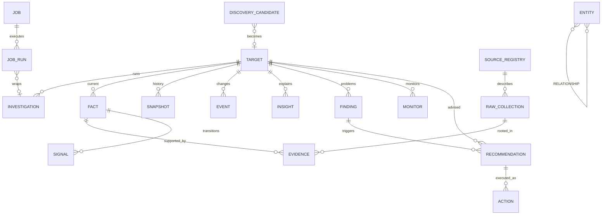

# SiteIntel 2.0 Data Architecture（数据架构冻结）

> 日期：2026-08-18 ｜ 只读冻结 ｜ 状态标记：EXISTING / PARTIAL / PLANNED / RECOMMENDED / DEPRECATED / CONFLICT
> 依据：真实 Schema（prisma/schema.prisma @ 27bbf93 + 生产 migration 20260817_multi_source_candidate_pool）+ 真实数据流（pipeline/facts/snapshots/events/entities）+ 生产数据规模

---

# 1. 数据原则（冻结）

1. **Data First**：先让数据正确，再做功能。
2. **Evidence First**：结论必须可追溯到 Source→Raw→Fact→Evidence。
3. **Relationship First**：关系与孤立数据同等重要（关系是资产）。
4. **History Matters**：当前状态不是全部。
5. **Quality > Quantity**：拒绝为“发现更多”牺牲质量。
6. **Safe by Default**：采集被动、安全、非破坏。
7. **AI Explains, Data Proves**。
8. **Small Closed Loops**：每层小闭环，禁止一步建几十张表。

---

# 2. 数据流与层职责

```text
Raw（RawCollection）       不可变原文；证据根
  ↓
Fact（Fact）               规范化当前状态；报告唯一读源；每 target+type 唯一
  ↓
Entity（Entity）           类型化实体；type+normalized 唯一；幂等 upsert
  ↓
Relationship               observed/probable/inferred；first/last seen；evidence
  ↓
Snapshot（Observation 存储） aspect 级时间点；hash 去重；历史存储
  ↓
Event                      变化事件；对外时间线（唯一事实源）
  ↓
Finding                    （PLANNED）状态化问题
  ↓
Insight                    规则解释；证据链+置信度；active/resolved
  ↓
Recommendation/Action/Verification（PLANNED）
```

现状对应：RawCollection/Fact/Evidence/Signal/Entity/EntityRelationship/Snapshot/Event/Insight/Contradiction 全部 EXISTING。

---

# 3. Canonical Semantic Dictionary（完整定义）

## 3.1 RawCollection
- 定义：一次 provider 采集的原文持久化。
- 输入：collectAll 各 provider 的 raw。
- 输出：Evidence 的根；重解析/重放基础。
- 生命周期：创建即不可变。
- 持久化：是（保留策略：90 天滚动，PLANNED）。
- 可删除：仅在治理授权下（备份后）。
- 可重建：否（原文不可再生）。
- 关系：Investigation N-1；Evidence N-1。

## 3.2 Fact
- 定义：规范化当前状态（每 target+factType 唯一）。
- 输入：Snapshot payload → 规范化。
- 输出：报告唯一读源；Signal/Event 的 diff 基。
- 生命周期：active / superseded / contradicted。
- 持久化：是；历史通过 Signal/Event 追溯（Phase 1 引入 schemaVersion + zod 校验）。
- 可删除：否（治理授权除外）。
- 可重建：是（从 Raw 重放）。
- 关系：Target N-1；Evidence N-N（evidenceIds，注意截断问题）；Signal 1-N。

## 3.3 Signal（CONFLICT → 内部化）
- 定义：Fact 状态迁移的内部过程记录（fact_created/changed/contradicted）。
- 决议：**不对外展示；Event 是唯一对外变化事实源**；Phase 1 收敛双轨。
- 持久化：保留（审计），但不再并行生成重复 Event。

## 3.4 Entity
- 定义：类型化实体（domain/subdomain/ip/asn/organization/provider/technology/ssl_certificate/tracking_id/email_provider/nameserver）。
- 输入：规范化提取；输出：图谱节点。
- 生命周期：首次/最近观测（firstSeenAt/lastSeenAt）。
- 持久化：是；可重建（从 Raw 重放，幂等）。
- 关系：Relationship 1-N。

## 3.5 EntityRelationship
- 定义：实体间关系（type+kind+confidence+evidence+first/last seen）。
- 生命周期：upsert 触达；未来 status（active/superseded）。
- 持久化：是；可重建（幂等重放）。
- 不可删除：治理授权除外。

## 3.6 Snapshot（Observation 的存储实现）
- 定义：aspect 级时间点载荷（dns/ip/ssl/http/technology/metadata/rdap/infrastructure/summary/full），hash 去重。
- 生命周期：创建后不可变；保留策略（每 aspect 最近 N 条，PLANNED）。
- 可重建：否（时间点不可再生）；可重放：是（重分析生成新行）。

## 3.7 Event
- 定义：变化事件（对外时间线唯一事实源）；previous/current + evidence 指针。
- 生命周期：创建后不可变。
- 可删除：治理授权（备份）或清理假阳性。

## 3.8 Insight
- 定义：基于证据的规则解释（active/resolved）。
- 输入：Event/Fact；输出：报告解释。
- 生命周期：重开语义（仍有效→touch；失效→resolved）。
- 可重建：是（规则引擎重跑）。

## 3.9 Finding（PLANNED）
- 定义：状态化问题（open/fixed/verified/reopened/false_positive/accepted_risk）。
- 输入：规则 + Fact/Evidence；输出：Recommendation。
- 生命周期：状态机；Event 记录其变化。

## 3.10 Recommendation / Action / Verification（PLANNED）
- Recommendation：建议（priority/impact/effort/evidence/status）。
- Action：被跟踪任务（status/dueAt/owner）。
- Verification：before/after 对比（re-scan → verified）。

## 3.11 DiscoveryCandidate
- 定义：潜在目标队列行（source/priority/score/probe 状态/退避/价值回填(PLANNED)）。
- 生命周期：pending → analyzed/skipped（失败保留重探）。
- 可删除：治理授权；可重建：否（候选是历史观察）。

## 3.12 Investigation vs Job
- Investigation：一次目标分析运行（running/completed/partial/failed）。
- Job（PLANNED）：通用任务包装；JobRun 包裹 Investigation 等全部后台任务。

---

# 4. 当前 Schema 清单与评估

| 模型 | 状态 | 评估 |
|---|---|---|
| Target | EXISTING | 稳定；isApex 已加 |
| Investigation | EXISTING | 稳定；未来被 JobRun 包裹 |
| RawCollection | EXISTING | 稳定；保留策略待加 |
| Entity / EntityRelationship | EXISTING | 稳定；关系 status 未来加 |
| Snapshot | EXISTING | JSONB 载荷，需 zod 校验 + 保留策略 |
| Event | EXISTING | 稳定；与 Signal 双轨待收敛 |
| Insight | EXISTING | hypothesis 字段语义越界（CONFLICT） |
| Fact / Evidence / Signal / Contradiction | EXISTING | Fact.value 需 zod + schemaVersion；Evidence 需补 source_url；Signal 内部化 |
| Monitor / User / ApiKey / DomainOwnership | EXISTING | 稳定 |
| Search*（7 表） | EXISTING | 行级正确；未来 Keyword 复用其思路 |
| DiscoveryCandidate | EXISTING | +18 列已部署；价值回填待加 |
| OrganizationAlias / OrganizationDenyLog | EXISTING | 治理层稳定 |
| Job/JobRun | PLANNED | Phase 1 最小两表 |
| SourceRegistry | PLANNED | Phase 1 轻量表 |
| SecurityFinding/Vulnerability/Remediation/FixVerification | PLANNED | Phase 4 |
| Keyword/KeywordObservation/KeywordRanking/SearchEngine | PLANNED | Phase 5 |
| Recommendation/Action/Verification | PLANNED | Phase 7 |

JSONB 清单（需约束，不消灭）：Fact.value、Snapshot.data、Event.previous/current、Insight.evidence/details、Entity.metadata、RawCollection.rawData、Relationship.evidence、DiscoveryCandidate.scoreReason/metadata。

索引缺口（规模化前补）：Event(targetId,type,detectedAt)、Insight(targetId,status)、Fact(lastSeenAt)、EntityRelationship 按 type/source.type 复合。

---

# 5. Entity 模型（四类）

| 类别 | 实体 | 存储 |
|---|---|---|
| Core Existing | Target/domain/subdomain/ip/asn/organization/certificate/technology/nameserver/provider/tracking_id/email_provider | Entity 表（现有） |
| Core Future | Page、SearchEngine、Keyword、SecurityFinding/Vulnerability、Recommendation/Action | 各自表（按阶段） |
| Derived | Website 视图、TechnologyVersion、CDN/HostingProvider、Country/Location、Opportunity 评分 | 计算，不落库或短期缓存 |
| Temporary | progress 步骤、SearchSyncJob 状态、Job 状态 | 现有/Job 表，非核心资产 |

---

# 6. Relationship 模型

字段（EXISTING）：sourceId/targetId/type/kind/confidence/evidence/firstSeenAt/lastSeenAt。
未来（PLANNED 字段）：status（active/superseded）。

规范化 type 清单（冻结）：

```text
resolves_to / hosted_by / uses / protected_by / shares / belongs_to /
redirects_to / associated_with（EXISTING）
+ 未来语义别名映射（不建新表）：has_certificate=shares(cert)、served_by=protected_by(cdn)、
  operated_by=belongs_to(org)、contains(san)=derived
```

禁止为一种新关系随意创建独立表。

---

# 7. Evidence / Source / Confidence

- Evidence（EXISTING）：investigationId/rawCollectionId/source/collector/observedAt/entityId/factType/rawValue/normalizedValue/confidence/expiresAt。
- 缺口（Phase 1）：rawValue 占位 → 补 source_url/raw_reference；Relationship/Insight 证据从 JSON 内嵌逐步规范化（保留内嵌，允许查询层聚合）。
- SourceRegistry（PLANNED）：统一登记 7 provider + cloudflare_radar + 未来 Security/SEO 源。
- Confidence（EXISTING 0-100）：统一展示层；未来加 source_count/source_quality/conflict_count/verified_at。

---

# 8. 时间模型

| 类 | 表/字段 | 策略 |
|---|---|---|
| Current State | Fact(lastSeenAt)、Entity/Relationship(lastSeenAt)、Monitor | 覆盖更新 |
| Historical State | Snapshot(createdAt)、Event(detectedAt)、Insight(first/lastDetectedAt) | 追加 |
| Immutable Record | RawCollection、Evidence | 只增 |
| Derived State | 评分/健康度 | 计算或短缓存 |

未来（PLANNED，不提前）：Relationship valid_from/valid_to；FactHistory（或 Signal 正规化）。

---

# 9. Fact 层设计

- 9 类 factType（resolved_ips/dns_records/tls_certificate/http_status/technologies/metadata/registrar/infrastructure/summary）。
- Phase 1（冻结）：zod 校验器（写入前 validate）；schemaVersion 列；Evidence 指针不截断（FactEvidence 关联或固化窗口语义）；Event/Signal 双轨收敛。
- 不建 FactHistory 表（Signal/Event 已能追溯；规模到后再说）。

---

# 10. Snapshot / Observation / Event

- Snapshot：保留现状（hash 去重、10 aspect）；补 zod 校验与保留策略。
- Observation：概念层 = Snapshot 语义；不建新表。
- Event：唯一对外时间线；Signal 内部化。

---

# 11. Finding / Insight

- Insight：保留现有表与规则引擎；hypothesis 字段仅搜索类规则使用（CONFLICT 收敛）。
- Finding（PLANNED）：Phase 4 建 SecurityFinding；Phase 5 SEO 复用同一 Finding 语义（表可统一 finding 抽象或各自表 + 统一接口）。

---

# 12. Discovery 数据

- 候选生命周期：pending → probe（probeStatus/score/退避）→ analyzed/skipped。
- 冻结补充（Phase 2）：value 回填列（analyzedValue/rootYield）；根域限额；SAN 降噪入池；admin 队列观测。
- 长期资产化：候选→Target 关联（sourceCandidateId）与价值反馈，让数据库驱动下一轮发现。

---

# 13. Job 数据

Phase 1 最小：Job（定义/类型/优先级/预算）+ JobRun（状态/重试/开始结束/错误）。
Phase 2+：JobAttempt/JobError/JobLog/JobCost（如需要）。
现有 SearchSyncJob 可作为 Job 子类型迁移（不删除）。

---

# 14. Security / SEO 数据映射（不建表）

见 Master Architecture §13/§14。原则：Observation 进 Fact/行表；Entity 进实体表；Derived 计算；只有状态机/不可表达时才建新表。

---

# 15. 数据增长与保留

| 数据 | 当前日增 | 保留策略（冻结） |
|---|---|---|
| RawCollection | ~1300 | 90 天滚动（归档/删除前备份） |
| Snapshot | ~1000 | 每 aspect 最近 200 条（hash 去重已控量） |
| Event | 少量 | 长期保留 |
| Fact/Evidence | 少量 | Evidence 只增；Fact 单行 |
| DiscoveryCandidate | 数百 | analyzed 保留；pending 治理 |
| Search 行表 | 少量 | 90 天滚动 |

分区：Target/Entity 达 50 万或对应表 >5GB 时评估按月分区（Phase 3+）。

---

# 16. 数据质量

巡检项（DATA_QUALITY Job，PLANNED）：duplicate/orphan/invalid/self-loop/stale/conflict/low-confidence/missing-evidence/broken relationship。
输出：Data Quality Score + 报告（admin/data-quality 已有雏形）。

---

# 17. Schema 演进规则（冻结）

1. 一次只加一个闭环所需的最小 schema。
2. 新业务模型建表（结构化列 + first/lastSeen + 证据指针 + 状态机）；载荷用 JSONB 必须说明理由。
3. migration：备份 → dry-run → 影响统计 → 授权 → 执行 → 验证 → 记录。
4. 禁止为未来功能预建表（SecurityFinding/Keyword/Recommendation 等按阶段）。

---

# 18. 目标 ER 图（演进态）



---

# 19. 规模化阈值（冻结）

| 维度 | 阈值 | 动作 |
|---|---|---|
| Target | 1-2 万 | 报告查询并行化 + 短缓存（Phase 1 就做） |
| Target | 5 万 | 候选队列 SQL 化；Job 消费器 |
| Entity | 50 万 / 表 5GB | 分区评估 |
| Relationship | 500 万 | 图查询索引审计；GraphDB 再评估 |
| 多实例 | 需要时 | Redis（限流/缓存） |
| 全文检索 | Target 20 万 / P95>500ms | 专用搜索评估 |
