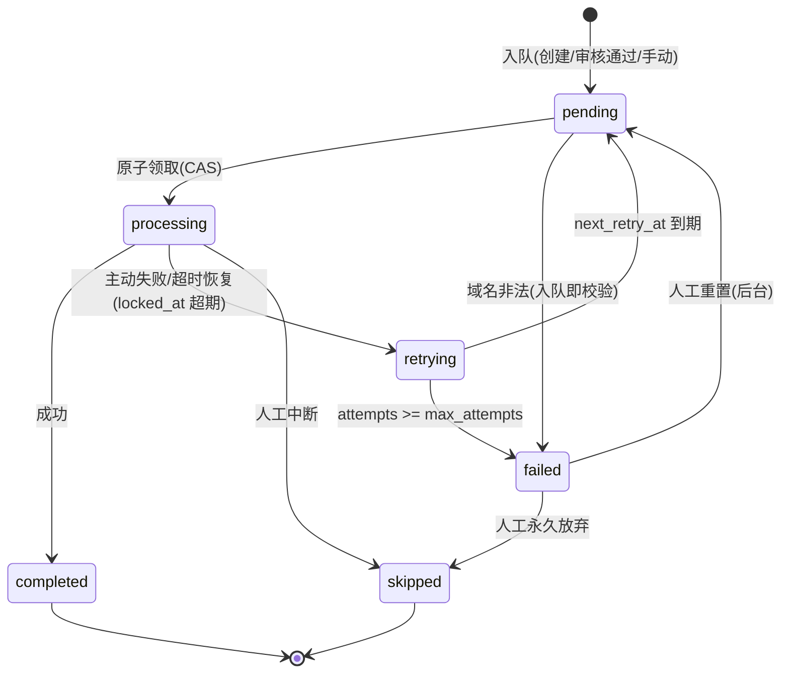
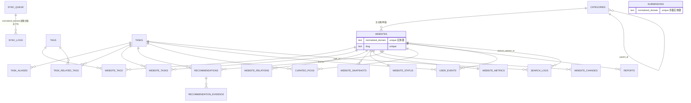

# 网址发现平台 — 数据库 Schema 与数据同步契约 V1.0（冻结版）

> **【冻结声明】本文件为"网址发现平台"数据库 Schema 与数据同步契约的正式冻结版本(2026-08-17 冻结)。冻结范围包括:**
> - 24 张数据表;
> - normalized_domain 实体规则;
> - Task / Tag 数据模型;
> - task_aliases / task_related_tags / website_tasks;
> - recommendations / recommendation_evidence;
> - website_snapshots / website_status / website_metrics / website_changes / website_relations;
> - sync_queue / sync_logs(含原子领取与 Worker Lock、最大重试边界);
> - SiteIntel → 导航站数据同步契约;
> - summary_hash 计算规则;
> - P0 / P1 数据边界。
> **冻结后任何对上述范围的修改不得直接修改本文件,必须走"变更提案 → 影响分析 → 新版本号 → 审计 → 新冻结版"流程(见文末"冻结后变更规则")。**

> 依据《网址发现平台-完整产品规划-V2.1.2-最终冻结版》§23 路线第 3/4 步执行。
> 上游输入:①技术架构 V1.0-rev1(18 节,含 A1/A2/B1/B2/B3 修订);②《SiteIntel 上游数据能力审计报告(架构阶段 1)》PASS WITH 2 GAPS。
> 本阶段只做 Schema 字段级设计 / 数据关系 / 索引 / 枚举 / 同步契约;**不写代码、不写 migrations、不写 schema.prisma、不写 API**。
> 版本:V1.0(2026-08-17 正式冻结)。状态:**已冻结**。前置:外部深度审计 PASS WITH 4 FIXES(A1-A4 修复)→ M1/M2 最终修复 → 18 项机械一致性检查 PASS(见《docs/audit/Schema冻结验收记录-V1.0.md》)。所有表/字段/枚举/契约规则以本文档为唯一依据。

---

# 0. 通用约定(先决条件)

1. **主键策略:统一 CUID**(text,Prisma `cuid()` 生成)。理由:①与 SiteIntel 同栈一致(Prisma 默认);②不泄漏业务序号(详情页 URL 不可枚举);③单机无需 UUID v7 时间序优势,索引插入性能与 UUID 相当且更短;④后续若多库/多实例无冲突。**全库唯一主键格式:`id text CUID`,不在任何表混用自增或 UUID**。
2. **时间戳统一**:`created_at / updated_at` 均为 `timestamptz`,默认 `now()`,`updated_at` 由应用层更新(与 SiteIntel 一致)。
3. **枚举实现**:`status / tag_type / event_type / relation_type` 等一律用 **text + CHECK 约束**(Prisma enum 之外的 DB 层约束)。理由:迁移演进灵活(加值不需要重建 enum),与 SiteIntel 的 String 枚举口径一致。
4. **来源标注**:字段列 `来源` 取值:【N】导航站自身数据、【S】SiteIntel 摘要同步、【N/S】以 N 为主 S 可回填、【派生】由系统定时计算。
5. **语义优先级**:本文档与架构 V1.0-rev1 冲突时,以本文档的字段级定义为准(架构为设计层,本档为冻结层);与冻结版 V2.1.2 冲突时,以冻结版为准,并视为缺陷上报。

---

# 1. 实体 → 数据来源总表

> 五问全覆盖:**创建者 / 数据归属 / 是否允许 SiteIntel 覆盖 / 是否允许人工修改 / 更新方式**。无任何"来源不明确"。

| 实体 | 数据由谁创建 | 数据属于谁 | 是否允许 SiteIntel 覆盖 | 是否允许人工修改 | 更新方式 |
|---|---|---|---|---|---|
| websites | 编辑(后台新建)/ 用户提交审核通过转建 / 编辑批量导入 | 导航站自身数据(域名事实字段允许 S 回填) | 仅限 title/summary_text/同步态字段(§6.3 白名单);display_name/description/category/status **永不被覆盖** | 是(管理后台全字段) | 编辑手动 + SiteIntel 同步(白名单字段) |
| categories | 编辑 | 导航站自身数据 | 否 | 是(管理后台) | 编辑手动 |
| tags | 编辑 | 导航站自身数据 | 否 | 是(管理后台) | 编辑手动 |
| website_tags | 编辑标注 / 规则标注(约束词典命中) | 导航站自身数据 | 否 | 是(管理后台) | 编辑手动 / 规则写入(source=rule) |
| tasks | 编辑 | 导航站自身数据 | 否 | 是(管理后台) | 编辑手动 |
| task_aliases | 编辑(Task 治理时录入) | 导航站自身数据 | 否 | 是(管理后台) | 编辑手动 |
| website_tasks | 编辑标注 / 规则批量 | 导航站自身数据 | 否 | 是(管理后台) | 编辑手动 / 规则写入 |
| website_relations | 编辑人工(替代优先)/ 规则(相似:Task/Category/Tag 重合度) | 导航站自身数据 | 否 | 是(管理后台) | 编辑手动 / 规则写入;**P0 allowlist 仅 similar/alternative,related 为 P1 门控(§2.9)** |
| task_related_tags | 编辑(Task 治理时录入)/ 规则 | 导航站自身数据 | 否 | 是(管理后台) | 编辑手动 / 规则写入 |
| website_snapshots | 系统(同步服务每次拉取) | 导航站摘要快照(SiteIntel 摘要派生) | 是(每次同步追加新快照,历史不覆盖) | 否(只读;删除仅限误写场景) | 同步事件写入 |
| website_status | 系统(同步服务 upsert) | 导航站当前聚合状态(SiteIntel 摘要派生) | 是(同步全量刷新) | 是(仅后台纠错回写,带 reports 审计) | 同步 upsert |
| website_metrics | 系统(定时计算) | 系统运行数据 | 否 | 否 | 定时计算 |
| website_changes | 系统(同步 diff 检测) | 系统运行数据 | 否 | 否 | 事件写入 |
| recommendations | 编辑(推荐决策)/ 规则(固定推荐集) | 导航站自身数据 | 否 | 是(管理后台) | 编辑手动 / 规则写入;**实时搜索永不写入** |
| recommendation_evidence | 编辑决策时系统生成 / 规则生成 | 导航站自身数据 | 否 | 是(仅随推荐编辑) | 随 recommendations 写入 |
| curated_picks | 编辑 | 导航站自身数据 | 否 | 是(管理后台) | 编辑手动 |
| submissions | 用户提交 | 导航站自身数据 | 否 | 是(审核流转) | 用户事件写入 + 编辑审核 |
| reports | 用户纠错 | 导航站自身数据 | 否 | 是(处理队列) | 用户事件写入 + 编辑处理 |
| user_events | 用户行为(服务端 cookie visitor_id) | 系统运行数据 | 否 | 否 | 事件写入 |
| search_logs | 系统(每次搜索) | 系统运行数据 | 否 | 否 | 事件写入 |
| sync_queue | 系统(入队:创建/审核通过/手动) | 系统运行数据 | 否 | 是(后台重置/跳过) | 队列状态机事件写入 |
| sync_logs | 系统(每次同步尝试) | 系统运行数据 | 否 | 否 | 事件写入 |
| settings | 系统(seed)+ 编辑 | 系统运行数据 | 否 | 是(管理后台白名单 key) | 编辑手动 |
| admin_users | 系统(初始化)/ 管理员 | 系统运行数据 | 否 | 是(管理员) | 手动 |

**覆盖规则总纲**:SiteIntel 覆盖权只存在两处——①websites 的 title/summary_text 与同步态字段;②website_status 全表(由 website_snapshots 派生)。其余全部导航站主权。

---

# 2. 逐表字段级冻结设计

> 列说明:类型中 `text?` 表示 NULL 允许;`text` 表示 NOT NULL。`来源` 取值见 §0.4。默认值为空表示无默认。

## 2.1 websites(核心实体,P0 重点)

**实体边界决策(先决)**:P0 website 实体 = **完整 Host(站点),www 折叠**。
- 决策依据:①SiteIntel 输入契约粒度 = `target.domain`(完整 host,如 www.figma.com / sub.example.com),同步零转换损耗;②产品语义"网站"是用户可访问的具体站点(冻结版 §11 SiteIntel 负责"域名基础信息"含 host 粒度);③www 是等价入口(www.example.com ≡ example.com),其他子域名(blog.example.com)是不同站点,不折叠。
- `normalized_domain` 折叠规则:全小写 → 去协议 → 去 `www.` 前缀 → 去尾部 `/` → 去端口 → IDN 转 punycode(A 标签)。**仅折叠 www,其余子域名保留**。
- 反例明确:example.com 与 www.example.com 视为**同一网站**;blog.example.com 是**另一个网站**。

| 字段 | 类型 | NULL | 默认值 | 来源 | 说明 |
|---|---|---|---|---|---|
| id | text | 否 | CUID | N | PK |
| domain | text | 否 | — | S | SiteIntel 返回/首次记录的原始 Host(如 www.figma.com),展示与详情页 URL 用;**非实体唯一键** |
| normalized_domain | text | 否 | — | N | 折叠后实体键(如 figma.com),**unique** |
| slug | text | 否 | — | N | 详情页路径键(如 figma-com),**unique**,由 normalized_domain 派生,可人工改 |
| display_name | text | 否 | — | N/S | 站点名,创建时回填自 SiteIntel title,人工可改;**同步不覆盖** |
| homepage_url | text | 否 | https:// + domain | N/S | 默认派生 `https://{normalized_domain}`,编辑可改 |
| title | text? | 是 | — | S | SiteIntel overview.title,同步刷新,仅供编辑参考(可被覆盖回填) |
| description | text | 否 | — | N | 编辑一句话描述(首屏核心层) |
| summary_text | text? | 是 | — | S | overview.summaryText(lang=zh),同步刷新 |
| category_id | text? | 是 | — | N | FK→categories.id,主分类单值,编辑设定 |
| status | text | 否 | `draft` | N | CHECK: `draft/pending/active/archived`(§16 删除策略) |
| source | text | 否 | `manual` | N | CHECK: `manual/submission`(创建途径:编辑建 / 用户提交审核通过转建) |
| seo_indexable | boolean | 否 | `false` | 派生 | 由阈值复核 tick 自动维护(有分类 + 状态 active + 质量分达标) |
| data_quality_score | int | 否 | `0` | 派生 | 0-100,§8.3 六维规则定时计算 |
| first_seen_at | timestamptz? | 是 | — | N | 导航站首次收录时间(创建时置 now()) |
| last_seen_at | timestamptz? | 是 | — | N | 最后一次"数据更新时间"(同步成功时刷新) |
| published_at | timestamptz? | 是 | — | N | 首次置 active 的时间 |
| created_at / updated_at | timestamptz | 否 | now() | N | |

约束与索引:
- `UNIQUE(normalized_domain)`、`UNIQUE(slug)`(**domain 不作为实体唯一判断依据**:www/裸域视为同一网站,由 normalized_domain 归并,§5);
- `INDEX(category_id)`(分类页列表查询)、`INDEX(status, seo_indexable)`(索引位复核 tick 扫描)、`INDEX(data_quality_score)`(质量分排序/阈值复核)。

## 2.2 categories

| 字段 | 类型 | NULL | 默认值 | 来源 | 说明 |
|---|---|---|---|---|---|
| id | text | 否 | CUID | N | PK |
| name | text | 否 | — | N | 分类名("AI 工具") |
| slug | text | 否 | — | N | **unique** |
| parent_id | text? | 是 | — | N | 自引用 FK→categories.id,onDelete SetNull(子分类,如 AI工具›图像生成) |
| description | text | 否 | '' | N | 分类说明(SEO 承载层) |
| sort_order | int | 否 | 0 | N | 导航顺序 |
| status | text | 否 | `active` | N | CHECK: `active/hidden` |
| seo_indexable | boolean | 否 | `false` | 派生 | 数量阈值达标自动 true |

索引:`INDEX(parent_id)`、`INDEX(status, sort_order)`。

## 2.3 tags(**tag_type 严格四枚举**,冻结版 §14)

| 字段 | 类型 | NULL | 默认值 | 来源 | 说明 |
|---|---|---|---|---|---|
| id | text | 否 | CUID | N | PK |
| name | text | 否 | — | N | 标签名("免费"/"AI"/"中文") |
| slug | text | 否 | — | N | **unique** |
| tag_type | text | 否 | — | N | CHECK: **仅** `attribute/feature/constraint/scenario`。**禁止新增第五种**;后台新建时选项即此四项 |
| group | text? | 是 | — | N | **仅为后台管理分组维度**(如 price/tech/platform 展示分组),不参与核心 Tag 类型语义、不参与搜索/匹配/过滤逻辑 |
| description | text | 否 | '' | N | |
| status | text | 否 | `active` | N | CHECK: `active/hidden`(不硬删,§16) |

索引:`INDEX(tag_type, status)`(后台筛选)、`UNIQUE(slug)`。

## 2.4 website_tags

| 字段 | 类型 | NULL | 默认值 | 来源 | 说明 |
|---|---|---|---|---|---|
| id | text | 否 | CUID | N | PK |
| website_id | text | 否 | — | N | FK→websites.id,onDelete **Cascade**(仅 draft 网站硬删时连带,§16) |
| tag_id | text | 否 | — | N | FK→tags.id,onDelete **Restrict**(Tag 只归档不删) |
| source | text | 否 | `manual` | N | CHECK: `manual/rule`(rule = 约束词典自动标注) |
| confidence | int | 否 | 100 | N | 0-100,rule 标注时按词典匹配强度赋值,manual 恒 100 |
| created_at | timestamptz | 否 | now() | N | |

约束:`UNIQUE(website_id, tag_id)`;索引 `INDEX(tag_id)`(按标签反查网站)。

## 2.5 tasks(Task ≠ Query 硬规则落地)

| 字段 | 类型 | NULL | 默认值 | 来源 | 说明 |
|---|---|---|---|---|---|
| id | text | 否 | CUID | N | PK |
| name | text | 否 | — | N | 用户语言命名("制作 PPT") |
| slug | text | 否 | — | N | **unique**(ppt-maker) |
| description | text | 否 | '' | N | 编辑撰写任务说明(SEO 唯一性,冻结版 §3) |
| status | text | 否 | `draft` | N | CHECK: `draft/active/pending_review/archived` |
| seo_indexable | boolean | 否 | `false` | 派生 | 阈值复核 tick 维护:候选 ≥ candidate_threshold 且 ≥ min_evidence_count 个完整推荐依据且质量分达标(冻结版 §3) |
| candidate_threshold | int | 否 | 5 | N | 候选网站数量阈值(后台可调) |
| min_evidence_count | int | 否 | 3 | N | 完整推荐依据条数阈值(后台可调) |
| candidate_count | int | 否 | 0 | 派生 | 定期重算 |
| created_at / updated_at | timestamptz | 否 | now() | N | |

索引:`INDEX(status, seo_indexable)`(阈值复核扫描)。

## 2.6 task_aliases(**独立表决策**)

**决策:aliases 独立建表,不用 tasks.aliases JSONB。**
理由(针对中文搜索 / Alias Dictionary / Top-1 ≥85% 验收):
1. **去重与冲突检测**:`UNIQUE(alias_normalized)` 全局唯一 —— 同义表达只能归属一个 Task,从结构上杜绝"两个 Task 抢同一 alias"导致的 Top-1 振荡;JSONB 无法施加此约束;
2. **验收可审计**:Top-1 ≥85% 测试集需要"按 alias 归属"统计命中/失败样本,独立表可按 alias 检索,JSONB 只能全量读改写;
3. **词典构建**:启动时 `SELECT` 全表一次即可构建内存词典(30-50 任务 × 每任务 5-15 条,规模极小),与 JSONB 载入成本相同;
4. **治理**:后台按 alias 检索、标注失效、冲突重分配,独立表天然支持;JSONB 每次编辑全量写回。
P0 不增加任何查询复杂度(词典始终全量载入内存,无按 alias 点查需求)。此决策与架构 V1.0 §6.1 `tasks.aliases jsonb` 的差异为 **Schema 级细化**(产品语义不变,冻结版 §3"aliases"为数组概念),已在 §15 一致性检查中登记。

| 字段 | 类型 | NULL | 默认值 | 来源 | 说明 |
|---|---|---|---|---|---|
| id | text | 否 | CUID | N | PK |
| task_id | text | 否 | — | N | FK→tasks.id,onDelete **Cascade**(Task 归档时 alias 一并失效;Task 不硬删,见 §16) |
| alias | text | 否 | — | N | 原始表达("做PPT") |
| alias_normalized | text | 否 | — | N | 归一化(小写/全角半角/去空白),**UNIQUE(alias_normalized)** 全局唯一 |
| weight | int | 否 | 50 | N | 匹配优先级(全等 > 前缀 > 包含,默认 50,后台可调) |
| source | text | 否 | `manual` | N | CHECK: `manual/rule` |
| status | text | 否 | `active` | N | CHECK: `active/hidden`(隐藏 = 词典停用,不改名) |
| created_at | timestamptz | 否 | now() | N | |

索引:`UNIQUE(alias_normalized)`、`INDEX(task_id)`。

## 2.7 task_related_tags(Task 隐含约束/特征/场景提示,结构化关系)

**用途(必须明确)**:Task 的隐含 Constraint / Feature / Scenario 提示。**仅用于搜索意图辅助与 Constraint Mapper 辅助**(如 Task=制作PPT 关联"免费/AI"标签,搜索"免费做PPT的AI网站"时提示扩展约束)。**不替代 website_tasks**(那是"网站能完成该任务"的事实关系),**不改变 Task ≠ Query** 硬规则。属冻结版允许的 Task Related Tags 概念的 Schema 层结构化(替代 V1.0 的 `tasks.related_tag_slugs` JSONB —— 与 tags/website_tags 结构化体系一致,可施加约束与检索)。

| 字段 | 类型 | NULL | 默认值 | 来源 | 说明 |
|---|---|---|---|---|---|
| id | text | 否 | CUID | N | PK |
| task_id | text | 否 | — | N | FK→tasks.id,onDelete Cascade(Task 不硬删,故实际保留) |
| tag_id | text | 否 | — | N | FK→tags.id,onDelete Restrict(Tag 只归档) |
| source | text | 否 | `manual` | N | CHECK: `manual/rule` |
| created_at | timestamptz | 否 | now() | N | |

约束:`UNIQUE(task_id, tag_id)`;索引 `INDEX(tag_id)`(按标签反查 Task,辅助搜索意图扩展)。

## 2.8 website_tasks

| 字段 | 类型 | NULL | 默认值 | 来源 | 说明 |
|---|---|---|---|---|---|
| id | text | 否 | CUID | N | PK |
| website_id | text | 否 | — | N | FK→websites.id,onDelete Cascade(仅 draft 硬删) |
| task_id | text | 否 | — | N | FK→tasks.id,onDelete Restrict(Task 只归档) |
| match_basis | text | 否 | '' | N | 匹配依据文案(推荐理由素材,"可免费在线制作 PPT") |
| source | text | 否 | `manual` | N | CHECK: `manual/rule` |
| sort_weight | int | 否 | 50 | N | 0-100,任务内默认排序权重(编辑可调) |
| override_score | int? | 是 | — | N | 人工固定分(§10 人工覆盖;置值后排序以 override 为准) |
| status | text | 否 | `active` | N | CHECK: `active/archived`(随 Task 归档联动) |
| created_at / updated_at | timestamptz | 否 | now() | N | |

约束:`UNIQUE(website_id, task_id)`;索引 `INDEX(task_id)`(任务页候选集查询主路径)、`INDEX(website_id)`。

## 2.9 website_relations

| 字段 | 类型 | NULL | 默认值 | 来源 | 说明 |
|---|---|---|---|---|---|
| id | text | 否 | CUID | N | PK |
| website_id_from / website_id_to | text | 否 | — | N | FK→websites.id,onDelete Restrict |
| relation_type | text | 否 | — | N | CHECK: `similar/alternative/related`;**P0 allowlist 仅 similar/alternative** — P0 禁止创建/自动生成/前端展示 related;related 为 P1 功能门控,保留枚举值仅为未来兼容 |
| basis | text | 否 | '' | N | 判定依据(人工:理由;规则:重合度描述) |
| source | text | 否 | `manual` | N | CHECK: `rule/manual` |
| confidence | int | 否 | 100 | N | 0-100 |
| status | text | 否 | `active` | N | CHECK: `active/superseded`(失效软标记,§16) |
| created_at / updated_at | timestamptz | 否 | now() | N | |

约束:`UNIQUE(website_id_from, website_id_to, relation_type)`;索引 `INDEX(website_id_from)`、`INDEX(website_id_to)`(详情页双向查询)。

## 2.10 website_snapshots(**导航站侧同步后的网站事实摘要快照**)

**语义冻结**:本表 = 导航站同步服务每次从 SiteIntel 报告**裁剪**出的业务摘要快照(历史,只追加)。**不是** SiteIntel 全量原始检测数据的镜像;禁止写入 evidence.rawData / 完整原始报告 / DNS 记录明细 / IP 明细列表 / 证书链。原始数据仍属 SiteIntel(架构 §3/§4.4)。

| 字段 | 类型 | NULL | 默认值 | 来源 | 说明 |
|---|---|---|---|---|---|
| id | text | 否 | CUID | N | PK |
| website_id | text | 否 | — | N | FK→websites.id,onDelete Restrict(网站只能归档,见 §16) |
| type | text | 否 | `sync` | N | CHECK: `sync`(同步快照;预留 editorial 未来用途,**P0 仅 sync**) |
| data | jsonb | 否 | — | S 派生 | 摘要快照对象,字段固定(见下表),顺序无意义 |
| summary_hash | text | 否 | — | 派生 | 该快照的确定性 hash(§13 规则) |
| created_at | timestamptz | 否 | now() | N | 快照时间 |

**snapshots.data 固定字段集**(与 §12 映射表一致):

```text
{
  checked_at, online, http_status,
  ip, asn, asn_org, country,          // 主 IP 单值摘要(§12.3)
  technologies: [],                   // 技术名称列表
  ssl_expiry, ssl_days_remaining,
  cdn, hosting,
  seo_summary: {robots, sitemap, word_count},   // overview 摘要(§12.3)
  health_summary: {}                  // audit 六维分数摘要,口径见 §12.3
}
```

索引:`INDEX(website_id, created_at DESC)`(详情页时间线)、`INDEX(website_id, type, created_at)`。
**保留策略:永久保留**(同步节奏 ≤ 1 次/日/站,增长受控;§16)。

## 2.11 website_status(**当前聚合状态**,单行/站)

| 字段 | 类型 | NULL | 默认值 | 来源 | 说明 |
|---|---|---|---|---|---|
| id | text | 否 | CUID | N | PK |
| website_id | text | 否 | — | N | FK→websites.id,onDelete Restrict,**UNIQUE** |
| online | boolean? | 是 | — | S | 最近一次检测是否可访问(呈现口径:"最近检测正常访问") |
| http_status | int? | 是 | — | S | |
| checked_at | timestamptz? | 是 | — | S | 最近检测时间(**不参与 summary_hash**,§13) |
| ip / asn / asn_org / country | text? | 是 | — | S | 主 IP 单值摘要(取 ips[] 首选) |
| technologies | jsonb | 否 | `[]` | S | 技术名称列表 |
| ssl_expires_at | timestamptz? | 是 | — | S | |
| ssl_days_remaining | int? | 是 | — | S | |
| cdn / hosting | text? | 是 | — | S | |
| seo_summary | jsonb | 否 | `{}` | S | robots/sitemap/word_count 摘要 |
| health_summary | jsonb | 否 | `{}` | S | audit 六维分数摘要(口径:SiteIntel 规则审计,非质量评分) |
| summary_hash | text | 否 | '' | 派生 | 当前状态确定性 hash(§13;输入字段见 §13.1) |
| last_sync_at | timestamptz? | 是 | — | N | 导航站上次同步成功时间(数据更新时间) |
| updated_at | timestamptz | 否 | now() | N | |

索引:`UNIQUE(website_id)`;`INDEX(summary_hash)` 不建(无查询场景)。**无 status_signals 字段** —— 变化信号由 website_changes 表驱动(§14)。

## 2.12 website_metrics(**长期统计指标**)

| 字段 | 类型 | NULL | 默认值 | 来源 | 说明 |
|---|---|---|---|---|---|
| id | text | 否 | CUID | N | PK |
| website_id | text | 否 | — | N | FK→websites.id,onDelete Restrict,**UNIQUE** |
| sync_count | int | 否 | 0 | 派生 | 同步成功次数 |
| change_count | int | 否 | 0 | 派生 | 变化信号累计次数 |
| task_count | int | 否 | 0 | 派生 | 挂载任务数(website_tasks active 计数) |
| month_clicks | int | 否 | 0 | 派生 | 近 30 天点击(用户事件聚合) |
| updated_at | timestamptz | 否 | now() | N | |

**三表职责边界(无重复)**:
- website_snapshots = **历史事实**(每次同步的摘要快照,追加);
- website_status = **当前聚合**(最新一份摘要的投影 + hash + 同步时间);
- website_metrics = **累计统计**(计数类派生指标);
- website_changes(§2.12)= **变化事件**(diff 结果,独立于三表)。

## 2.13 website_changes(**变化信号,P0 所需,§14 论证**)

| 字段 | 类型 | NULL | 默认值 | 来源 | 说明 |
|---|---|---|---|---|---|
| id | text | 否 | CUID | N | PK |
| website_id | text | 否 | — | N | FK→websites.id,onDelete Restrict |
| change_type | text | 否 | `siteintel_sync` | N | CHECK: `siteintel_sync`(P0 唯一;上游 events API 上线后扩展) |
| delta | jsonb | 否 | — | 派生 | `[{field, from, to}]` 仅摘要字段(§13.1 集合内),如 `[{"field":"online","from":true,"to":false}]` |
| hash_prev / hash_next | text | 否 | — | 派生 | 变化前后 summary_hash(审计锚点) |
| created_at | timestamptz | 否 | now() | 派生 | 检测时间 |

索引:`INDEX(website_id, created_at DESC)`(详情页"近期变化"时间线,取最近 N 条,默认 5)。
**保留策略**:每站仅保留最近 20 条(滑动删除,后台可调);历史变化可从 snapshots 链推算。**证明 P0 所需**:冻结版 §12 用户端"网站状态与变化信号"为 P0 必做,详情页需要结构化变化时间线;不建此表则变化信息只能塞 website_status JSONB(违反"禁止无限塞 JSONB")或丢失。

## 2.14 recommendations(**稳定推荐定义层,非实时搜索缓存**)

> 硬规则:实时搜索 / 任务页访问**永不写入本表**(架构 V1.0 §8.6)。本表只承载:编辑推荐、人工排序覆盖、固定 Task×Website 推荐关系、需长期审计的推荐决策。

| 字段 | 类型 | NULL | 默认值 | 来源 | 说明 |
|---|---|---|---|---|---|
| id | text | 否 | CUID | N | PK |
| website_id | text | 否 | — | N | FK→websites.id,onDelete Restrict |
| task_id | text? | 是 | — | N | FK→tasks.id,onDelete Restrict;任务页/搜索上下文推荐挂 Task,首页/详情可不挂 |
| context | text | 否 | — | N | CHECK: `task_page/search/detail/home`(该推荐面向的展示位;编辑决策时记录) |
| score | float | 否 | — | N | 编辑决策时的五因子加权分(规则计算)或人工定分 |
| confidence | text | 否 | `medium` | N | CHECK: `high/medium/low` |
| source | text | 否 | — | N | CHECK: `rule/manual`(rule=系统按配置生成的固定推荐集;manual=人工决策) |
| status | text | 否 | `active` | N | CHECK: `active/superseded`(失效软标记,§16;**不硬删**) |
| created_at / updated_at | timestamptz | 否 | now() | N | |

索引:`INDEX(website_id, task_id, context)`、`INDEX(context, status)`(固定推荐集查询)、`INDEX(task_id)`。

## 2.15 recommendation_evidence(推荐依据,一对多)

| 字段 | 类型 | NULL | 默认值 | 来源 | 说明 |
|---|---|---|---|---|---|
| id | text | 否 | CUID | N | PK |
| recommendation_id | text | 否 | — | N | FK→recommendations.id,onDelete **Cascade**(随推荐行;推荐不硬删,故历史保留) |
| evidence_type | text | 否 | — | N | CHECK: `task_match/constraint_match/quality/status_signal/editorial`(冻结版五因子,**仅此五枚举**) |
| factor_name | text | 否 | — | N | 具体因子(如 `task:制作PPT`、`tag:free`) |
| score | float | 否 | — | N | 分项得分 |
| basis | jsonb | 否 | — | N | 依据明细:匹配的 alias / 命中的 tag id / 质量维度 / 状态字段值 / 精选条目 id |
| generated_by | text | 否 | `rule` | N | CHECK: `rule/manual` |
| created_at | timestamptz | 否 | now() | N | |

- **Evidence 允许多条**(0..N):一条推荐可同时有 task_match + constraint_match + editorial 等多条证据(五因子可多因并存);
- **删除/失效**:不删除,随 recommendations 一并 superseded;
- 索引:`INDEX(recommendation_id)`(主查询路径)。

## 2.16 curated_picks

| 字段 | 类型 | NULL | 默认值 | 来源 | 说明 |
|---|---|---|---|---|---|
| id | text | 否 | CUID | N | PK |
| website_id | text | 否 | — | N | FK→websites.id,onDelete Restrict |
| task_id | text? | 是 | — | N | FK→tasks.id,onDelete Restrict(可选挂载) |
| reason | text | 否 | '' | N | 编辑理由(推荐理由素材) |
| sort_order | int | 否 | 0 | N | 展示顺序 |
| status | text | 否 | `draft` | N | CHECK: `draft/published/archived` |
| published_at | timestamptz? | 是 | — | N | 首次发布 |
| created_at / updated_at | timestamptz | 否 | now() | N | |

索引:`INDEX(status, sort_order)`(首页/任务页展示位查询)。

## 2.17 submissions

| 字段 | 类型 | NULL | 默认值 | 来源 | 说明 |
|---|---|---|---|---|---|
| id | text | 否 | CUID | N | PK |
| domain | text | 否 | — | N | 用户提交原始域名(展示/审核参考) |
| normalized_domain | text | 否 | — | N | 折叠后实体键(§5 规则),**UNIQUE**(防重复:www.example.com 与 example.com 提交视为同一) |
| note | text | 否 | '' | N | 提交者说明 |
| ip / user_agent | text | 否 | '' | N | 防刷记录(不展示) |
| status | text | 否 | `pending` | N | CHECK: `pending/approved/rejected/duplicate` |
| reviewed_by / reviewed_at / review_note | text?/timestamptz?/text? | 是 | — | N | 审核信息;approved → 系统转建 websites 草稿(source=submission),review_note 记录 |

**保留策略**:永久保留(审计);不做硬删。

## 2.18 reports(数据纠错)

| 字段 | 类型 | NULL | 默认值 | 来源 | 说明 |
|---|---|---|---|---|---|
| id | text | 否 | CUID | N | PK |
| website_id | text | 否 | — | N | FK→websites.id,onDelete Restrict |
| field | text | 否 | — | N | 纠错字段白名单:`display_name/description/category_id/homepage_url/online/http_status/technologies/ssl_expires_at/cdn/hosting` |
| current_value / expected_value | jsonb | 否 | — | N | 当前值 / 用户期望值 |
| note | text | 否 | '' | N | 用户说明 |
| status | text | 否 | `pending` | N | CHECK: `pending/accepted/rejected/resolved` |
| resolved_value | jsonb? | 是 | — | N | accepted 时应用层回写目标字段后记录实际写入值 |

**保留策略**:永久保留(审计);accepted 回写须在 status 表或 websites 上留痕(以 resolved_value + 回写时间佐证,不建额外审计表)。

## 2.19 user_events(匿名行为统计;收藏**不**在此)

| 字段 | 类型 | NULL | 默认值 | 来源 | 说明 |
|---|---|---|---|---|---|
| id | text | 否 | CUID | N | PK |
| visitor_id | text | 否 | — | N | 服务端 cookie 生成/读取(不接受客户端传入);**仅匿名行为统计,禁止参与收藏** |
| event_type | text | 否 | — | N | CHECK: `visit/reason_expand/submit/search_click`(**无 favorite/unfavorite**——收藏为纯前端本地数据,不产生服务端事件) |
| website_id / task_id | text? | 是 | — | N | FK onDelete **SetNull**(事件为历史,网站归档不影响) |
| payload | jsonb? | 是 | — | N | 事件附加(如 reason 展开类型) |
| created_at | timestamptz | 否 | now() | N | |

索引:`INDEX(visitor_id, event_type)`(行为画像,P2)、`INDEX(event_type, created_at)`(指标聚合,月点击统计)。

## 2.20 search_logs

| 字段 | 类型 | NULL | 默认值 | 来源 | 说明 |
|---|---|---|---|---|---|
| id | text | 否 | CUID | N | PK |
| query / query_normalized | text | 否 | — | N | 原始查询 / 归一化 |
| task_id | text? | 是 | — | N | FK→tasks.id,onDelete SetNull(Top-1 识别结果) |
| constraints | jsonb | 否 | `[]` | N | 提取的约束(tag slug 列表) |
| result_count | int | 否 | 0 | N | 结果数 |
| clicked_website_id | text? | 是 | — | N | FK→websites.id,onDelete SetNull(点击回流) |
| visitor_id | text? | 是 | — | N | 匿名 cookie(空 = 未启用 cookie) |
| created_at | timestamptz | 否 | now() | N | |

索引:`INDEX(query_normalized, created_at)`(词典迭代证据)、`INDEX(task_id, created_at)`(Top-1 命中率统计主路径)。**保留 90 天自动清理**(后台可调;原始语料无长期价值)。

## 2.21 sync_queue(任务队列,字段级冻结)

| 字段 | 类型 | NULL | 默认值 | 来源 | 说明 |
|---|---|---|---|---|---|
| id | text | 否 | CUID | N | PK |
| domain | text | 否 | — | N | 同步对象原始 Host(展示/日志) |
| normalized_domain | text | 否 | — | N | 折叠后实体键(§5 规则);**入队/领取/幂等均以它为准** |
| job_type | text | 否 | `sync` | N | CHECK: `sync`(P0 唯一:统一流程 report→404 则 analyze→回填;analyze/report 拆分留给未来 events 端点) |
| payload | jsonb | 否 | `{}` | N | 扩展参数(如 lang, 当前恒 zh) |
| status | text | 否 | `pending` | N | CHECK: `pending/processing/completed/retrying/failed/skipped`(状态机见 §9) |
| priority | int | 否 | 0 | N | 越小越先(后台手动同步 = -10 插队) |
| locked_at | timestamptz? | 是 | — | N | worker 领取时间(锁) |
| locked_by | text? | 是 | — | N | 领取 worker 标识(单实例 = 进程 ID) |
| attempts | int | 否 | 0 | N | 失败/超时累计次数;自增后用更新后值判定(§9 重试边界规则) |
| max_attempts | int | 否 | 5 | N | 最大失败尝试次数:attempts >= max_attempts → failed(第 5 次失败即 failed,无第 6 次;settings.sync_queue.max_attempts 可调) |
| next_retry_at | timestamptz? | 是 | — | N | 退避到期时间;到期前不可领取 |
| last_error | text? | 是 | — | N | 最近错误摘要 |
| last_http_status | int? | 是 | — | N | 最近上游 HTTP 状态(429/5xx 判断) |
| summary_hash | text? | 是 | — | N | 上次成功同步的 hash(去重参考) |
| created_at / updated_at | timestamptz | 否 | now() | N | |

约束:`UNIQUE(normalized_domain, job_type)`(幂等,www/裸域同站不重复入队);索引 `INDEX(status, next_retry_at)`(领取主查询)、`INDEX(status, locked_at)`(超时恢复扫描)、`INDEX(priority)`。

## 2.22 sync_logs

| 字段 | 类型 | NULL | 默认值 | 来源 | 说明 |
|---|---|---|---|---|---|
| id | text | 否 | CUID | N | PK |
| domain | text | 否 | — | N | 原始 Host(记录) |
| normalized_domain | text? | 是 | — | N | 折叠后实体键(§5 规则,关联查询用;不做去重键) |
| action | text | 否 | — | N | CHECK: `sync/analyze/report/diff` |
| status | text | 否 | — | N | `success/failed/retry` |
| http_status | int? | 是 | — | N | |
| error | text? | 是 | — | N | |
| duration_ms / payload_size | int | 否 | 0 | N | 耗时 / 上游载荷大小 |
| created_at | timestamptz | 否 | now() | N | |

索引:`INDEX(normalized_domain, created_at)`(按实体查日志)。**保留 30 天自动清理**(后台可调)。

## 2.23 settings

| 字段 | 类型 | NULL | 默认值 | 来源 | 说明 |
|---|---|---|---|---|---|
| key | text | 否 | — | N | **UNIQUE**,白名单:`ranking.weights / quality.weights / task.index_thresholds / constraint.dictionary / website_changes.retention / search_logs.retention_days / sync_queue.max_attempts`(默认 5,判定语义见 §9 重试边界规则;配置后以 settings 值为准,须 ≥1) |
| value | jsonb | 否 | — | N | 配置值 |
| updated_at | timestamptz | 否 | now() | N | |

## 2.24 admin_users(最小登录,**非账号体系**)

| 字段 | 类型 | NULL | 默认值 | 来源 | 说明 |
|---|---|---|---|---|---|
| id | text | 否 | CUID | N | PK |
| email | text | 否 | — | N | **UNIQUE**;登录白名单与 ADMIN_EMAILS 环境变量交集校验 |
| password_hash | text | 否 | — | N | scrypt |
| name | text? | 是 | — | N | |
| created_at | timestamptz | 否 | now() | N | |

**确认:不建立 users / favorites / accounts / sessions / profiles 等任何账号体系表**(P0 收藏 = 前端本地,§15)。

---

# 3. 本地收藏确认(P0 无服务端收藏)

- **favorites 不建服务端表**;收藏 = 前端 localStorage / IndexedDB(前端决定);
- **favorites 不进入 user_events**(§2.19 event_type 无收藏事件);
- **visitor_id 仅匿名行为统计**;禁止任何服务端收藏关联;
- 本 Schema 无 users/accounts/sessions 表(§2.23 admin_users 仅为后台管理登录,不是用户账号体系);
- P1 账号体系之前,收藏率等收藏指标服务端不可统计(本地收藏无服务端数据源;P1 建账号与云端收藏体系时,再通过 migration 增加相关数据模型)。

---

# 4. recommendations 冻结(稳定推荐定义层确认)

- **写入来源仅两类**:①编辑在后台创建/修改推荐、人工排序覆盖、明确建立 Task×Website 固定推荐关系(§2.8 override_score 同时生效);②系统按后台配置生成的固定推荐集(source=rule,如任务页默认推荐集合)。
- **实时搜索执行层**:rank / 排序 / 推荐理由全部内存计算,**默认不写** recommendations 与 recommendation_evidence(架构 §8.6 硬规则,§15 检查项 7 复核)。
- **Task × Website 关系**:由 website_tasks(候选关系)+ recommendations(推荐决策)双层表达 —— website_tasks 是"这个站能完成这个任务"的事实关系,recommendations 是"把它推荐给用户"的决策记录;两者不合并(事实 vs 决策,冻结版 §15 语义)。
- **人工覆盖**:website_tasks.override_score 直接替换该关系在排序中的 task_match 计算分;覆盖决策同时落 recommendations(source=manual)+ evidence(editorial 或 task_match,basis 记录覆盖理由)。
- **删除/失效**:一律 `superseded`,不硬删(审计要求,冻结版 §15"重要推荐可追溯")。
- **Evidence 多对一**:允许多条,五因子各一条 + 人工备注;随推荐 superseded,不单独删除。

---

# 5. websites 边界与 domain 处理(决策复述)

| 问题 | 决策 | 理由 |
|---|---|---|
| domain 是否唯一 | **否**;唯一键为 `normalized_domain` + `slug` | domain 仅记录原始 Host 供展示;www/裸域同站由 normalized_domain 归并,domain 不承担去重 |
| normalized_domain 处理 | 折叠:小写 → 去协议 → 去 www. → 去尾斜杠 → 去端口 → punycode;**子域名保留** | www 等价入口折叠;子域名是不同站点 |
| 实体边界 | **完整 Host(www 折叠)** | SiteIntel Target 粒度一致;产品"网站"= 站点 |
| homepage_url | 默认派生 `https://{normalized_domain}`,编辑可改 | 派生免维护,编辑覆盖保真 |
| 同步覆盖边界 | 仅 title/summary_text/同步态字段 | §1 覆盖规则总纲 |

**折叠示例**:`HTTPS://WWW.Figma.Com/` → domain=`WWW.Figma.Com`(原始保留)/ normalized_domain=`figma.com` / slug=`figma-com`。

---

# 6. Tag 四枚举确认

- `tags.tag_type` CHECK 仅 `attribute/feature/constraint/scenario`;后台新建界面枚举即此四项,无第五种;
- `tags.group` 仅为管理分组维度(后台筛选/展示),**不参与**核心 Tag 类型语义与搜索匹配(§2.3);
- 约束词典示例(§12.4 同步契约外,属导航站内部):`免费→tag(free, constraint)`、`AI→tag(ai, feature)`、`在线→tag(online, feature)`、`中文→tag(chinese, attribute)`、`无需注册→tag(no-signup, attribute)` —— 全部落四枚举之一;
- website_tags 字段克制:仅 website_id/tag_id/source/confidence/created_at,**不加** 排序权重/过期时间等未用字段(避免"以后可能需要")。

---

# 7. 三表(四对象)语义冻结

| 对象 | 定义 | 写入 | 保留 |
|---|---|---|---|
| website_snapshots | 同步后的**网站事实摘要快照**(历史,只追加) | 同步服务每次成功拉取 | 永久 |
| website_status | **当前聚合状态**(单行投影 + summary_hash) | 同步 upsert | 常驻 |
| website_metrics | **长期统计指标**(计数) | 定时计算 | 常驻 |
| website_changes | **变化事件**(diff 结果) | diff 检测 | 每站最近 20 条 |

职责无重叠:快照=历史事实;status=当前态;metrics=累计数;changes=变化事件。任一字段只归属一处(§15 检查项 6)。

---

# 8. 索引设计(逐表,克制)

| 表 | 索引 | 查询场景 |
|---|---|---|
| websites | UNIQUE(normalized_domain) / UNIQUE(slug) | 实体唯一键 / 详情页路由(domain 不去重) |
| websites | INDEX(category_id) | 分类页网站列表 |
| websites | INDEX(status, seo_indexable) | 索引位复核 tick 扫描 |
| websites | INDEX(data_quality_score) | 质量分排序/阈值复核 |
| categories | INDEX(parent_id) / INDEX(status, sort_order) | 分类树 / 导航展示 |
| tags | UNIQUE(slug) / INDEX(tag_type, status) | 标签路由 / 后台筛选 |
| website_tags | UNIQUE(website_id, tag_id) / INDEX(tag_id) | 幂等 / 按标签反查 |
| tasks | INDEX(status, seo_indexable) | 阈值复核扫描 |
| task_aliases | UNIQUE(alias_normalized) / INDEX(task_id) | 词典去重 / 构建词典 |
| task_related_tags | UNIQUE(task_id, tag_id) / INDEX(tag_id) | 幂等 / 按标签反查 Task(搜索意图辅助) |
| website_tasks | UNIQUE(website_id, task_id) / INDEX(task_id) / INDEX(website_id) | 任务页候选集 / 详情页任务列表 |
| website_relations | UNIQUE(from,to,type) / INDEX(from) / INDEX(to) | 相似/替代展示(双向) |
| website_snapshots | INDEX(website_id, created_at DESC) | 详情页时间线 |
| website_status | UNIQUE(website_id) | 当前状态 |
| website_changes | INDEX(website_id, created_at DESC) | 近期变化时间线 |
| recommendations | INDEX(website_id, task_id, context) / INDEX(context, status) / INDEX(task_id) | 固定推荐集 / 审计查询 |
| recommendation_evidence | INDEX(recommendation_id) | 推荐依据 |
| curated_picks | INDEX(status, sort_order) | 展示位 |
| submissions | UNIQUE(normalized_domain) | 提交去重(www/裸域归并) |
| reports | INDEX(status, created_at) | 纠错队列 |
| user_events | INDEX(visitor_id, event_type) / INDEX(event_type, created_at) | 行为聚合(P2)/ 月点击统计 |
| search_logs | INDEX(query_normalized, created_at) / INDEX(task_id, created_at) | 词典迭代 / Top-1 命中率统计 |
| sync_queue | UNIQUE(normalized_domain, job_type) / INDEX(status, next_retry_at) / INDEX(status, locked_at) | 幂等 / 领取 / 超时恢复 |
| sync_logs | INDEX(normalized_domain, created_at) | 排障(按实体查日志) |

**不建索引清单**(无查询场景):website_status.summary_hash、snapshots.summary_hash、websites.homepage_url、settings.value。

---

# 9. sync_queue 状态机与领取语义

**重试边界统一规则(冻结,消除 off-by-one 歧义)**:
1. 每次同步失败(主动失败或超时恢复)先执行 `attempts + 1`;
2. 使用**更新后**的 attempts 判定:
   - `attempts >= max_attempts` → `status = failed`(直接失败,不再重试);
   - `attempts < max_attempts` → `status = retrying`,设置 `next_retry_at`(退避公式 `min(2^attempts × 60s, 4h)`,attempts 为更新后值);
3. 默认 `max_attempts = 5`(settings.sync_queue.max_attempts 可调):**最多允许 5 次失败尝试;第 5 次失败后直接进入 failed;不得出现"第 6 次失败才 failed"的实现**;
4. 超时恢复同样计入 attempts(超期 processing 视为一次失败尝试,同边界判定)。

## 9.1 状态机



## 9.2 状态转换表

| 当前 | 事件 | 目标 | 条件/动作 |
|---|---|---|---|
| pending | 领取 | processing | 原子条件更新成功(§9.3) |
| processing | 成功 | completed | 同步完成,写 sync_logs |
| processing | 失败 | retrying | 429/5xx/网络错/404→analyze 后失败;attempts+1 后 attempts < max_attempts → retrying;next_retry_at=now()+min(2^attempts×60s, 4h)(attempts 为更新后值) |
| processing | 失败 | failed | 同上场景;attempts+1 后 attempts >= max_attempts → 直接 failed,写 sync_logs(第 5 次失败即 failed,无第 6 次) |
| processing | 超时 | retrying | locked_at < now()-10min(含 systemd 重启);attempts+1 后 attempts < max_attempts → retrying |
| processing | 超时 | failed | 同上;attempts+1 后 attempts >= max_attempts → failed(超时计入失败尝试,同边界规则) |
| retrying | 到期 | pending | next_retry_at ≤ now() |
| retrying | 超限 | failed | attempts >= max_attempts(默认 5;第 5 次失败即 failed,无第 6 次) |
| pending | 非法 | failed | 域名格式校验失败 |
| failed | 人工重置 | pending | 后台操作,attempts 清零 |
| failed | 人工放弃 | skipped | 后台操作 |
| processing | 人工中断 | skipped | 后台操作 |

## 9.3 原子领取(Prisma 事务语义,非业务代码)

```sql
-- 领取 SQL 语义:单条条件更新 = Compare-And-Set
UPDATE sync_queue
SET status = 'processing', locked_at = now(), locked_by = :worker_id, updated_at = now()
WHERE id = (
  SELECT id FROM sync_queue
  WHERE status = 'pending'
    AND (next_retry_at IS NULL OR next_retry_at <= now())
  ORDER BY priority ASC, next_retry_at ASC NULLS FIRST, id ASC
  LIMIT 1
)
RETURNING *;
-- 影响行数 = 1 → 领取成功; = 0 → 无可领取任务或已被其他 tick 抢先
```

Prisma 实现要求:`updateMany` 条件 `status='pending' AND (next_retry_at IS NULL OR next_retry_at <= now())`,**返回值 count==1 才视为领取成功**;禁止"先 SELECT 再 UPDATE"两段式(竞态窗口)。

## 9.4 超时恢复(每个 tick 最先执行)

```sql
-- 步骤 1:attempts+1 后未达上限 → retrying(退避基于更新后 attempts)
UPDATE sync_queue
SET status = 'retrying', attempts = attempts + 1,
    next_retry_at = now() + retry_interval(attempts + 1),
    updated_at = now()
WHERE status = 'processing' AND locked_at < now() - interval '10 minutes'
  AND attempts + 1 < :max_attempts;

-- 步骤 2:attempts+1 后达到上限 → 直接 failed(第 max_attempts 次失败即 failed,无第 6 次)
UPDATE sync_queue
SET status = 'failed', attempts = attempts + 1, updated_at = now()
WHERE status = 'processing' AND locked_at < now() - interval '10 minutes'
  AND attempts + 1 >= :max_attempts;
```
(:max_attempts 取自 settings.sync_queue.max_attempts,默认 5;`retry_interval(n) = min(2^n × 60s, 4h)`。)

systemd 重启后所有 processing 行 locked_at 必然超期 → 按重试边界规则分派:未达上限 → retrying → 到期回 pending(断点续跑);已达上限 → failed。锁持有期 10 分钟 > 单任务最坏执行时长(analyze 轮询分钟级)。幂等由 `UNIQUE(normalized_domain, job_type)` + 摘要 upsert + summary_hash 零写保证。

---

# 10. 推荐/关系/内容生命周期(删除与状态策略)

| 对象 | 删除策略 | 理由 |
|---|---|---|
| websites | **软归档**:`active → archived`;仅 `draft` 且无下游引用(recommendations/relations/reports 无行)允许硬删 | 历史审计不损坏;外键 Restrict 保护 |
| categories / tags / tasks | 只 `archived/hidden`,不硬删 | 引用行(website_tags/website_tasks/task_aliases)通过 Restrict 保护;展示层过滤 status |
| website_tags / website_tasks | 随网站硬删 Cascade;Tag/Task 归档时行保留 | 保留历史关系事实 |
| task_related_tags | Task 归档时行保留(tag_id Restrict);Task 不硬删故实际保留 | 隐含提示关系随 Task 生命周期 |
| recommendations + evidence | 只 `superseded`,不硬删 | 冻结版 §15 审计硬要求 |
| website_relations | 只 `superseded` | 人工判定不可逆 |
| website_snapshots | **永久保留** | 变化历史与审计;同步节奏 ≤1 次/日/站,增长受控 |
| website_changes | 每站保留最近 20 条(滑动),后台可调 | P0 展示只需近期;完整链可由 snapshots 重建 |
| sync_queue | completed/failed/skipped 保留 30 天自动清理 | 排障窗口 |
| sync_logs | 保留 30 天自动清理 | 同上 |
| search_logs | 保留 90 天自动清理 | 词典迭代窗口 |
| submissions / reports / user_events | **永久保留**(事件体积小) | 审计与指标基础 |

外键总则:**历史/审计表一律 Restrict**(snapshots/status/metrics/changes/recommendations/evidence/relations/reports/submissions);**引用随源对象级联**仅限 website_tags/website_tasks(源对象为 draft 硬删场景)与 recommendation_evidence(源为推荐行);**事件类 SetNull**(user_events/search_logs 引用网站/任务,归档不影响历史)。

---

# 11. SiteIntel → 导航站同步契约(字段级映射)

## 11.1 请求契约

- 端点:`GET https://siteintel.cc/api/v1/report/{domain}?lang=zh`(阶段 1 审计确认,覆盖需求 90%+);
- 身份:`X-API-Key: si_<navigation-sync 专用 Key>`(在 SiteIntel 管理端创建,rateLimitPerHour 按需配置;仅存服务器 .env,前端永不接触);
- 404(未分析)→ 入队触发 `POST /api/v1/analyze`(同 Key,受 30/h 硬顶)→ 回填后重拉(架构 §4.2);
- **normalize 流程(契约强制)**:`target.domain` → 折叠(§5)→ `normalized_domain` → 按 `normalized_domain` 查找已有 website → 存在则 upsert 原站,不存在则新建。**禁止按裸 domain 判断存在性**,否则 www.example.com 与 example.com 会被建成两个 Website;
- 幂等:失败重试无害(`UNIQUE(normalized_domain, job_type)` + upsert + hash 零写)。

## 11.2 完整映射表

> 转换规则中"摘要"= 裁剪后单值/名称列表,绝不整表镜像。

| SiteIntel 字段 | 导航站字段 | 转换规则 | 是否持久化 |
|---|---|---|---|
| target.domain | websites.domain | 原样(实体键原始值) | ✅ |
| —(派生) | websites.normalized_domain / slug | §5 折叠规则;**实体查找/去重键** | ✅ |
| overview.title | websites.title | 原样;用于 display_name 回填(仅创建时) | ✅ |
| overview.description | websites.title 参考 / 不落库 | 编辑主权,不覆盖 | ❌ |
| overview.summaryText(lang=zh) | websites.summary_text | 原样 | ✅ |
| overview.categories | 忽略(仅编辑参考) | 分类由导航站编辑定义 | ❌ |
| overview.websiteStatus.online | website_status.online / snapshots.data.online | 原样 | ✅ |
| overview.websiteStatus.status | website_status.http_status / snapshots.data.http_status | 原样 | ✅ |
| overview.websiteStatus.checkedAt | website_status.checked_at / snapshots.data.checked_at | 原样;不参与 hash | ✅ |
| infrastructure.ips[0] | website_status.ip / snapshots.data.ip | **主 IP 单值**,不存明细列表 | ✅ |
| infrastructure.ips[0].asn / asn.org | website_status.asn / asn_org / snapshots.data 同 | 单值摘要 | ✅ |
| infrastructure.ips[0].country | website_status.country / snapshots.data.country | 单值摘要 | ✅ |
| infrastructure.ips[] 全量 | 忽略 | 明细归 SiteIntel | ❌ |
| infrastructure.dns.{records,nameservers,provider} | 忽略 | 明细归 SiteIntel(导航站不做 DNS 展示) | ❌ |
| infrastructure.ssl.{validTo,daysRemaining} | website_status.ssl_expires_at / ssl_days_remaining / snapshots.data.ssl_* | 原样 | ✅ |
| infrastructure.ssl 证书链明细 | 忽略 | 明细归 SiteIntel | ❌ |
| infrastructure.cdn.name | website_status.cdn / snapshots.data.cdn | 原样 | ✅ |
| infrastructure.hosting.name | website_status.hosting / snapshots.data.hosting | 原样(含"藏在 CDN 后"诚实标记透传为 null) | ✅ |
| technology[].name | website_status.technologies / snapshots.data.technologies | **仅名称列表**;version/confidence/firstSeenAt 忽略 | ✅ |
| overview.{hasRobots,hasSitemap,wordCount,h1Count,internalLinks} | website_status.seo_summary / snapshots.data.seo_summary | 摘要对象 {robots, sitemap, word_count} | ✅ |
| audit(六维) | website_status.health_summary / snapshots.data.health_summary | 分数摘要;**口径:SiteIntel 规则审计,非质量评分,不得进入推荐理由文案** | ✅ |
| history[] | 忽略 | P0 变化信号由本地 summary_hash diff 产生(§13/§14);上游 events API 上线后接入 | ❌ |
| insights | 忽略 | 变化洞察不落库(P0 不做) | ❌ |
| recommendations / contradictions | 忽略 | 上游自评,非导航站推荐依据 | ❌ |
| evidence[] 及 rawData | **禁止持久化** | 阶段 1 审计:单域名可达数百 KB,导航站只存摘要 | ❌ |
| redirects / 其他未列出字段 | 忽略 | 边界外 | ❌ |

## 11.3 持久化顺序(单次同步事务)

```text
GET report(lang=zh) 成功
  → normalize(target.domain → normalized_domain, §5) → 查找/确认 website 实体(去重)
  → 裁剪(§11.2 映射) → 构建 summary_hash(§13)
  → 对比 website_status.summary_hash:
      不同 → 追加 website_snapshots(新快照) + upsert website_status
            + 写 website_changes(diff) + website_metrics.sync_count/change_count++
      相同 → 仅刷新 website_status.last_sync_at + last_seen_at(零写原则)
  → sync_queue → completed;sync_logs 落 success
```

---

# 12. summary_hash 规则冻结

## 12.1 参与 hash 的字段(固定集合)

```text
online
http_status
ip
asn
asn_org
country
technologies(排序后)
ssl_expires_at(ISO 固定时区)
cdn
hosting
seo_summary(规范化)
health_summary(规范化)
```

**明确排除**:checked_at、last_sync_at、updated_at、title、description、summary_text、display_name(时间与内容编辑字段的变化**不产生**变化信号——避免"每 24 小时重拉必报变化"的误判)。

## 12.2 算法与规范化

1. 取 §12.1 字段构造对象;
2. **canonicalize**:键按字典序排序;嵌套 JSON(technologies/seo_summary/health_summary)内部数组排序(字符串按 Unicode 码点)后序列化;时间统一 `YYYY-MM-DDTHH:MM:SSZ`;数值归一化(无前导零/科学计数);
3. 序列化为确定性 JSON(无空白差异);
4. `SHA-256(UTF-8 bytes)` → hex 小写 64 字符;
5. 写入 website_status.summary_hash 与当前快照的 summary_hash(两者一致)。

## 12.3 变化判定

- `new_hash != old_hash` → 生成 diff:逐字段比较新旧快照数据,产出 `[{field, from, to}]`(仅 §12.1 集合内字段),写 website_changes;
- `new_hash == old_hash` → 零写(只刷 last_sync_at);
- 误判防线:canonicalize 保证字段顺序/格式差异不产生假变化;checked_at 排除保证定时重拉不产生假事件。

---

# 13. 变化信号与 website_changes 论证

- **P0 不依赖 SiteIntel events API**(阶段 1 缺口 2,有降级路径):变化信号 = 本地 summary_hash diff(§12);
- **新增 website_changes 表**(§2.12):P0 必需 —— 冻结版 §12 用户端"网站状态与变化信号"要展示"近期变化"时间线,需要结构化记录"何时、哪个字段、从什么到什么";替代方案(website_status JSONB 数组)违反"禁止无限塞 JSONB"、无索引可查、不可审计;
- **边界**:完整变化历史由 website_snapshots 链可重建(每快照带 hash);website_changes 只保留最近 20 条滑动窗口 —— 变化**历史**在 snapshots,变化**事件**在 changes,当前**状态**在 status,三者边界清晰;
- 上游 events API 上线后:website_changes 扩展 change_type,写入来源增加上游增量事件,展示层不变。

---

# 14. ER 关系图



(注:sync_queue/sync_logs 与 websites 以 **normalized_domain** 逻辑关联(domain 仅原始输入/展示/日志,不承担实体唯一性/去重/关联/幂等任何职责),**不建 FK**(队列对象可能先于网站存在);submissions 与 websites 由审核动作联动,不建 FK。)

---

# 15. Schema 内部一致性检查(机械)

| # | 检查项 | 结果 | 依据 |
|---|---|---|---|
| 1 | 所有实体来自 V2.1.2 或技术架构 | ✅ | 24 表全部可追溯:冻结版 §15 19 组 + 架构 §6.2 辅助表(sync_logs/settings/admin_users)+ 细化拆分(task_aliases/task_related_tags/website_changes 见检查 2 登记;task_related_tags 由 tasks.related_tag_slugs JSONB 细化而来,冻结版"relatedTags"数组概念不变) |
| 2 | 是否偷偷新增账号体系 | ✅ | 无 users/favorites/accounts/sessions;admin_users 仅为后台登录 |
| 3 | 是否新增 P1/P2 功能 | ✅ | 无 month_favorites(V1.0-rev1 删除);website_changes 有 P0 论证(§13);task_aliases/task_related_tags/website_changes 为 Schema 级细化,非新功能 |
| 4 | tag_type 严格四种 | ✅ | CHECK 约束仅四枚举;group 标注为管理分组字段;全文无第五种 |
| 5 | 无重复实体 | ✅ | website_relations 单表承载 three 类型;tags 单表四类型;无 Activity 类表 |
| 6 | snapshots/status/metrics 职责不重叠 | ✅ | §7 边界表:历史/当前/累计/事件各归其位;status 无 status_signals 字段 |
| 7 | recommendations 不被实时搜索污染 | ✅ | 写入来源仅编辑决策/固定推荐集(§4);实时搜索内存计算不落库 |
| 8 | favorites 不进服务器数据库 | ✅ | 无表、无端点、user_events 无收藏事件(§3) |
| 9 | sync_queue 完整状态恢复 | ✅ | 状态机 + 原子领取 + 超时恢复 + 退避 + 最大重试 + 断点续跑(§9) |
| 10 | SiteIntel 无数据库耦合 | ✅ | 仅 API v1 + Key(§11);evidence.rawData 明确禁止持久化 |
| 11 | summary_hash 无误判 | ✅ | 排除 checked_at/last_sync_at/title/description;canonicalize 规则(§12) |
| 12 | 索引支撑 P0 查询 | ✅ | §8 逐表索引对应查询场景;不建清单明确 |
| 13 | 删除策略不毁历史 | ✅ | 审计表 Restrict;推荐 superseded;snapshots 永久(§10 外键总则) |
| 14 | website_relations P0 allowlist 门控 | ✅ | relation_type CHECK 三枚举,但 P0 allowlist 仅 similar/alternative;related 禁止创建/自动生成/展示(§2.9) |
| 15 | month_favorites 彻底删除 | ✅ | 全文无 month_favorites 字段/索引/说明/检查项引用(§2.12) |
| 16 | tasks.related_tag_slugs JSONB 已替代 | ✅ | 无 related_tag_slugs 残留;task_related_tags 表承接(§2.7),仅辅助搜索意图,不替代 website_tasks |
| 17 | normalized_domain 为唯一实体键 | ✅ | websites 仅 UNIQUE(normalized_domain)/UNIQUE(slug),domain 非唯一(§2.1);submissions/sync_queue/sync_logs 去重与关联均用 normalized_domain(§8/§11);sync_queue↔sync_logs 逻辑关联与索引同为 normalized_domain(§14) |
| 18 | sync_queue 重试边界冻结(off-by-one 消除) | ✅ | 统一规则:每次失败 attempts+1,用更新后值判定,attempts >= max_attempts → failed(第 5 次失败即 failed,无第 6 次);§9 规则块/§9.1 状态机/§9.2 转换表(失败/超时均双分支)/§9.4 恢复 SQL 两步骤/§2.21 字段说明/settings.sync_queue.max_attempts 全一致 |

**登记的三处 Schema 级细化(与架构 V1.0-rev1 的差异,非产品语义变化)**:
1. `tasks.aliases`(JSONB)→ 独立表 `task_aliases`(§2.6,理由:去重约束/验收统计/治理);
2. `website_status.status_signals`(JSONB)→ 独立表 `website_changes`(§2.13/§13,理由:变化时间线结构化 + 防 JSONB 膨胀);
3. `tasks.related_tag_slugs`(JSONB)→ 独立表 `task_related_tags`(§2.7,V1.0-rev1 新增,理由:结构化外键 + UNIQUE 幂等 + 按标签反查;仅辅助搜索意图/Constraint Mapper,不替代 website_tasks)。架构文档可在 Schema 冻结后同步此三点字段级描述。

---

# 16. 结论

1. **Schema 设计成立**:24 表字段级冻结完成(含任务书要求的全部实体),主键/时间戳/枚举/索引/删除策略/外键总则全部明确;数据来源矩阵五问全覆盖,无"来源不明确"。
2. **同步契约成立**:v1/report 单端点映射表完整(§11.2),覆盖边界(website 白名单字段 / snapshots / status / 忽略清单)清晰;summary_hash 与变化信号规则冻结(§12/§13)。
3. **状态**:已冻结(V1.0,2026-08-17);冻结前不执行 Prisma migrate / schema.prisma / API 开发;后续开发按冻结版实施。

---

# 附:A. 待办与未决(供下一阶段)

| # | 事项 | 状态 |
|---|---|---|
| 1 | 网站正式域名 | 未决(不影响 Schema 冻结;上线前须完成) |
| 2 | SiteIntel 侧创建 navigation-sync 专用 Key(rateLimitPerHour 按需) | 未决(需 SiteIntel 管理员操作) |
| 3 | SiteIntel 缺口 1(analyze 30/h 硬顶放开)排期 | 未决(小票) |
| 4 | SiteIntel 缺口 2(v1/events 增量端点)排期 | 未决(P1 前) |
| 5 | 服务器 PostgreSQL 实例/权限确认(独立库 nav_disc) | 未决 |
| 6 | 架构 V1.0-rev1 同步 task_aliases / task_related_tags / website_changes 字段级描述 | 已冻结;回写架构文档待执行 |
| 7 | 外键实现级别(Prisma relationMode 与 DB CHECK/约束) | 待开发阶段定 |

---

# V1.0-rev1 外部审计修订记录(2026-08-17)

> 外部 Schema 审计结论:**PASS WITH 4 FIXES**。以下 4 项已全部直接回写正文,文档结构/表数量同步更新,并新增机械检查项 14-17 覆盖本轮修复。
> 【历史状态】本节撰写时仍为候选版;2026-08-17 已正式冻结为 V1.0,本记录归档于《docs/audit/Schema冻结验收记录-V1.0.md》。

| # | 审计问题 | 修复内容(回写位置) |
|---|---|---|
| A1 | website_relations 的 related 必须 P0/P1 门控 | relation_type 行增加 **P0 allowlist 仅 similar/alternative**:P0 禁止创建/自动生成/前端展示 related;related 为 P1 功能门控,保留枚举值仅为未来兼容(§2.9);§1 矩阵同步标注 |
| A2 | website_metrics.month_favorites 彻底删除 | 字段行、索引、说明、检查项引用全部移除;全文无残留(§2.12/§15 检查项 15) |
| A3 | tasks.related_tag_slugs JSONB → 结构化表 | 新增 `task_related_tags`(id/task_id/tag_id/source/created_at,UNIQUE(task_id,tag_id),source CHECK manual/rule),用途限定:Task 隐含约束提示,仅辅助搜索意图/Constraint Mapper,**不替代 website_tasks**(§2.7);表数量 23→24;§1 矩阵/§8 索引/§10 删除策略/§14 ER/§15 检查项同步 |
| A4 | www 折叠统一到 normalized_domain | websites 删除 UNIQUE(domain),domain 非实体唯一键(§2.1);submissions UNIQUE(normalized_domain)、sync_queue UNIQUE(normalized_domain, job_type)、sync_logs 增加 normalized_domain 列(§2.17/§2.21/§2.22);§8 索引/§9.4 幂等/§11.1 normalize 流程(契约强制:target.domain → normalize → normalized_domain → 查找 → upsert)/§11.3/§14 ER/§15 检查项 17 同步 |

> 【历史状态】本节撰写于冻结前(候选版阶段);2026-08-17 已正式冻结为 V1.0(冻结验收见《docs/audit/Schema冻结验收记录-V1.0.md》)。

---

# 冻结后变更规则(2026-08-17 生效)

本文件为**冻结版**。**任何以下修改都不得直接修改本文件**:

- 新增或删除数据表;
- 修改主键或唯一键;
- 修改 normalized_domain 规则;
- 修改 tag_type 四枚举;
- 修改 Task / Query 边界;
- 修改 recommendations 持久化规则;
- 修改 snapshots / status / metrics / changes 四表语义;
- 修改 sync_queue 状态机;
- 修改 SiteIntel 数据同步字段范围;
- 修改 P0 / P1 数据边界。

必须通过以下流程:

**变更提案 → 影响分析 → 新版本号 → 审计 → 新冻结版**

即:提出变更提案(理由 + 预期影响)→ 影响分析(涉及表 / 契约 / 上下游)→ 分配新版本号(如 V1.1 候选版)→ 外部审计 → 审计通过后冻结为新版本,本版本归档保留。
